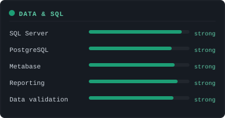
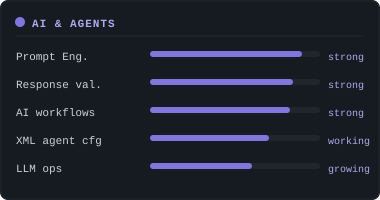
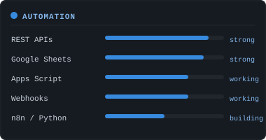
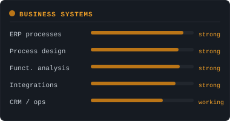

<!-- HEADER: capsule-render waving banner with teal/dark gradient -->


<!-- TYPING SVG: animated terminal intro -->
<p align="center">
  
</p>

<!-- BADGES ROW -->
<p align="center">
  <a href="mailto:andres123stacruz@gmail.com">
    
  </a>
  <a href="https://linkedin.com/in/andres-santa-cruz">
    
  </a>
  
  
</p>

<p align="center">
  
  
  
  
</p>

---

## `>_` About

```
I turn messy business operations into structured systems.

SQL · reporting · APIs · automation · ERP · AI-assisted workflows.
I make data actually useful inside real operations teams — not just in demos.
```

---

## `>_` Current focus

```
    AI AGENTS & LLM WORKFLOWS
    Prompt structures · response validation · XML-based agent config
    AI-assisted workflows running inside real business operations.

    AUTOMATION & INTEGRATIONS
    Connecting ERPs, APIs, databases and internal tools.
    Less manual work. More reliability.

    DATA & REPORTING
    SQL Server for analysis, reporting and troubleshooting.
    Metabase dashboards that non-technical teams can actually use.
```

---

## `>_` What I actually do

```
✔  Functional + technical analysis in ERP and business environments
✔  SQL Server queries for reporting, troubleshooting and data validation
✔  API integrations and endpoint validation across operational systems
✔  Metabase implementation and reporting environments
✔  Prompt engineering, XML-based agent config and response validation
✔  Process improvement across support, data and internal operations
```

---

## `>_` Skill stack

<p align="center">
  
  
</p>
<p align="center">
  
  
</p>

---

## `>_` Tech I work with

<p align="center">
  
</p>
<p align="center">
  
  
  
  
  
  
  
  
</p>

---

## `>_` What I'm building now

```json
{
  "direction":  ["data analytics", "automation engineering", "AI ops"],
  "building":   "automation toolkit for SMB operations",
  "learning":   "LangChain · RAG · advanced agent patterns",
  "open_to":    ["Data Analyst", "Automation Eng.", "AI Ops", "Technical Solutions"],
  "timezone":   "UTC-3 (flexible)",
  "languages":  ["Spanish", "English (B1)"]
}
```

---

## `>_` GitHub Stats

<p align="center">
  
</p>
<p align="center">
  
</p>


